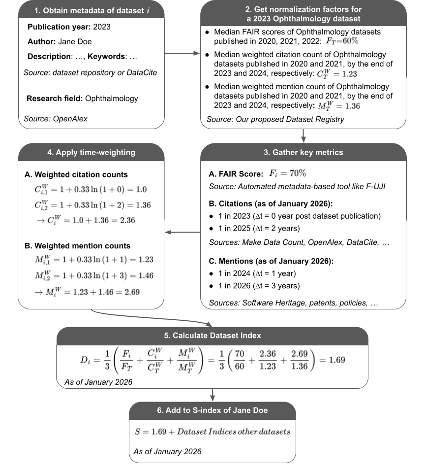

# Concepts

This page explains how Scholar Data calculates the S-index and Dataset Index (D-index).

## Proposed S-index

We introduce a framework in which a dataset $i$ is assigned a **Dataset Index** $D_i$ that combines FAIRness, scholarly citations, and alternative mentions. A researcher's **S-index** is then defined as the sum of the Dataset Indices of their $N$ datasets:

$$
D_i=\frac{1}{3}\left(\frac{F_i}{F_T}+\frac{C_{i}^w}{C_{T}^w}+\frac{M_{i}^w}{M_{T}^w}\right),
\qquad
\text{S-index}=\sum_{i=1}^{N} D_i
$$

Here, $F_i$ is the FAIR score between 0 and 1 (or 0 to 100%) of dataset $i$. $C_{i}^w$ and $M_{i}^w$ are logarithmic time-weighted counts of the $P$ citations and $Q$ alternative mentions to dataset $i$:

$$
C_{i}^w=\sum_{c=1}^{P}\left[1+0.33\times\ln\left(1+\Delta t_{i,c}\right)\right],
\qquad
M_{i}^w=\sum_{q=1}^{Q}\left[1+0.33\times\ln\left(1+\Delta t_{i,q}\right)\right]
$$

Here, $\Delta t$ represents the time in years between the citation/mention event and the dataset’s publication. This weighting is designed to reward sustained reuse: a citation/mention on the day of dataset publication counts as 1, while one 20 years later counts as 2.

$F_T$, $C_{T}^w$, and $M_{T}^w$ are normalization factors intended to control for differences in field size, data reuse culture, and changing practices over time. They are calculated as 3-year moving medians based on datasets from the same field.

## Example

An example of S-index calculation is provided in **Fig. 1**. Calculation only requires dataset metadata from existing infrastructure, enabling large-scale calculation regardless of dataset size, format, reuse license, and access conditions.

_Figure 1. Example of the calculation of the Dataset Index of a dataset and the S-index of its author. Steps 1-5 need to be repeated for each dataset of the researcher to calculate their S-index. Steps 3B to 6 need to be repeated periodically (e.g., monthly) to account for new citations and mentions. The FAIR score will change if there are major updates to the data repository’s metadata practices, and normalization factors will change if we identify citations or mentions we may have missed in prior years, so they could be updated as well_
