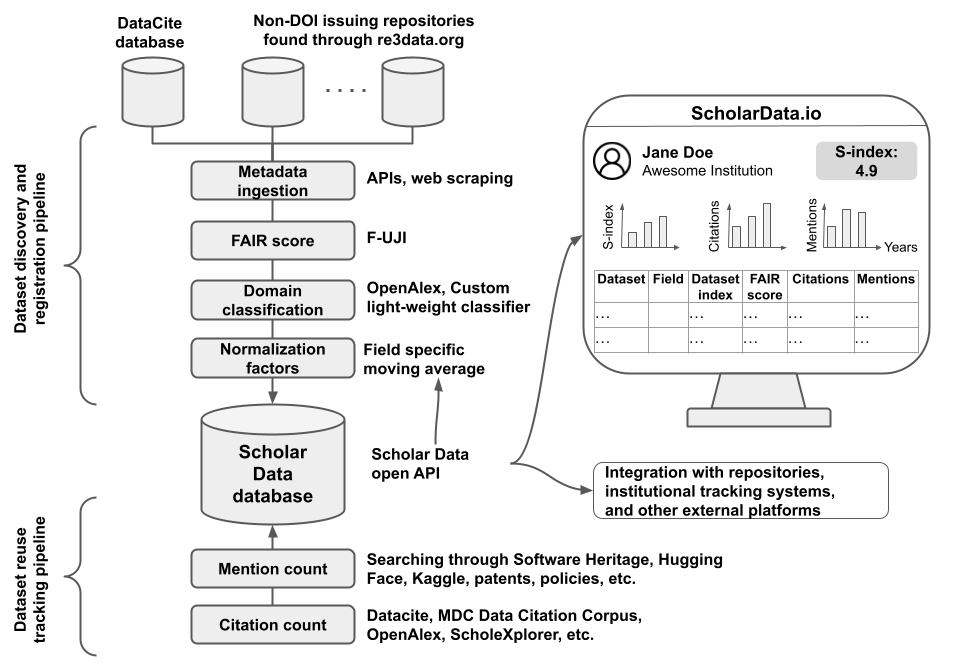

# Data Collection: Overview

This section describes how the data shown on Scholar Data is collected and computed,
including datasets, FAIR scores, citations, alternative mentions, and auto-generated
researcher profiles.

## Where the Data Comes From

Every metric on Scholar Data is derived from publicly available research
infrastructure: dataset registries, citation indexes, code repositories, patent
databases, and more. No data is self-reported by researchers. Scores are computed automatically
from these external sources using documented, reproducible methods.

## Current Data

The data currently shown on Scholar Data represents a
point-in-time calculation rather than a live feed. Scores reflect the citations,
mentions, and FAIR assessments available at the time of processing (see individual
pages in this section for specific dates). We started with the data from our large scale validation (described in the [Validation](../s-index-guide/validation.md) page) and are progressively adding more.

## Long-Term Vision

The goal is a fully automated pipeline that runs periodically, continuously
discovering new datasets, recomputing FAIR scores, identifying new citations and
mentions, and updating D-index and S-index values over time (see Figure 1 below). We expect to establish that as the project progresses.

_Figure 1. Overview of the targeted automated pipelines for collecting dataset-level data to compute the S-index of researchers_

## What's Covered in This Section

- [**Datasets**](datasets): what datasets are in the Scholar Data database and
  where they come from
- [**FAIR Scores**](fair-scores): how dataset FAIRness is assessed
- [**Citations**](citations): how formal citations to datasets are identified
- [**Mentions**](mentions): how mentions in code repositories, patents, and
  other sources are found
- [**Research Fields**](research-fields): how a research field is assigned to each
  dataset to enable field-specific normalization
- [**Auto-Generated Profiles**](auto-profiles): how researcher profiles are
  assembled automatically and S-index scores computed
