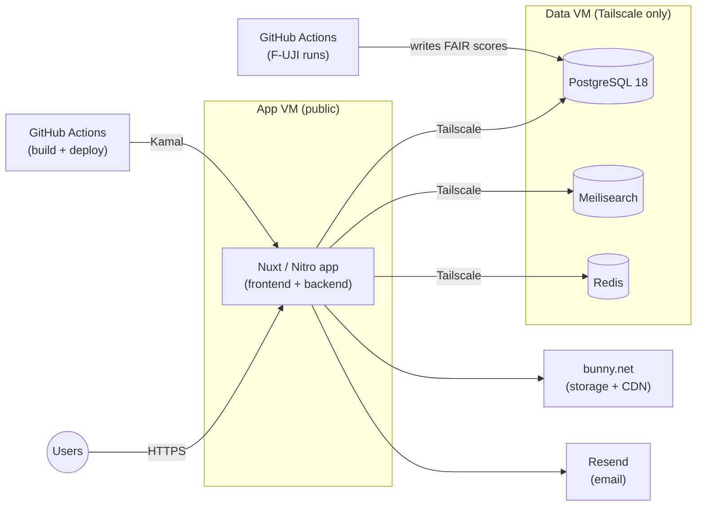

# Platform Development

This page describes the architecture, tools, and platforms used to build and run Scholar Data. It's meant as a reference for the team and for anyone curious about how the platform works under the hood.

## Application Stack

Scholar Data is a single [Nuxt](https://nuxt.com/) application, using [Nitro](https://nitro.build/) as the server engine for both frontend rendering and backend API routes. The codebase is written in TypeScript, with [Nuxt UI](https://ui.nuxt.com/) as the component library. The source code is available on GitHub at [data-S-index/web-app](https://github.com/data-S-index/web-app).

## Data Layer

- **PostgreSQL 18** is the primary database, storing dataset metadata, researcher profiles, D-index/S-index scores, and related records. It currently holds over 1.1 billion rows!
- **Meilisearch** powers search across datasets, profiles, and other indexed content.
- **Redis** handles caching for autogenerated profiles and other frequently accessed data.

## Infrastructure

Scholar Data runs on two [DigitalOcean](https://www.digitalocean.com/) virtual machines:

- **Data VM**: runs PostgreSQL, Meilisearch, and Redis, each as Docker containers. It is not exposed to the public internet (the only access is through [Tailscale](https://tailscale.com/)).
- **App VM**: runs the Nuxt/Nitro application (frontend and backend) as a Docker container and is the only publicly reachable service. It connects to Postgres, Meilisearch, and Redis on the Data VM over the Tailscale private network.

Keeping the database and cache off the public internet while still letting the app reach them directly is the main reason for this split.

_Figure 1. Scholar Data's application and data infrastructure._

## Deployment

The Nuxt/Nitro app is deployed to the App VM with [Kamal](https://kamal-deploy.org/). A GitHub Actions workflow builds a Docker image of the app and has Kamal roll it out to the App VM.

## FAIR Score Computation

FAIR scores are computed with F-UJI (see [FAIR Scores](data-collection/fair-scores.md)). Rather than running a dedicated F-UJI service, Scholar Data uses GitHub Actions: a workflow spins up the [F-UJI Docker image](https://github.com/pangaea-data-publisher/fuji) inside the Actions runner, assesses a batch of datasets against it, and tears the instance down when the job finishes. This avoids maintaining FAIR-assessment infrastructure continuously and scales with GitHub's runner capacity.

## Static Assets & Email

- **[bunny.net](https://bunny.net/)** provides storage and CDN for public static files, such as sitemaps.
- **[Resend](https://resend.com/)** is the email provider for transactional email (sign-up confirmations, notifications, etc.).

## Backups

Database backups are currently taken manually. The Postgres database is over 300GB, and a compressed (gzip) backup is over 7GB. A more automated backup process is something we are working towards as the platform grows.
