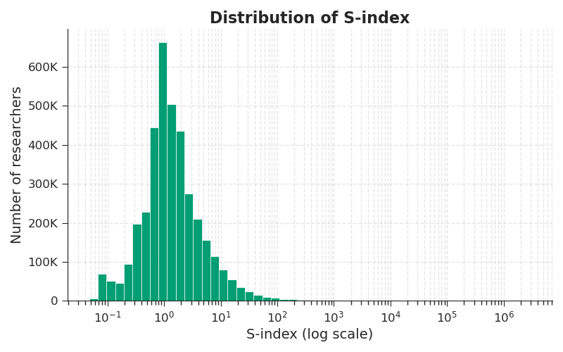
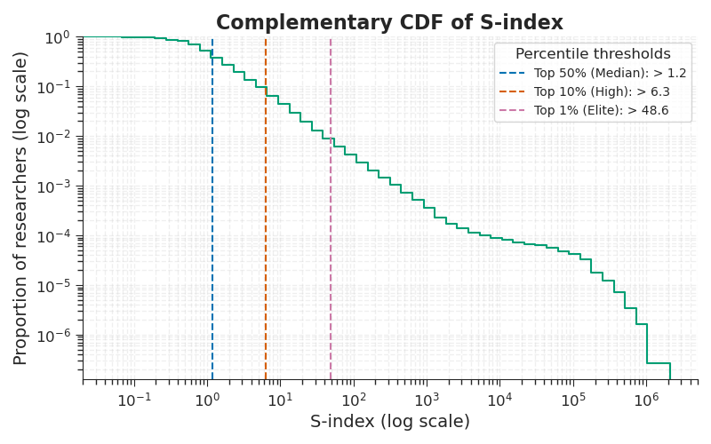

# Validation

This page details how we validated that the S-index is realistically feasible to compute using existing infrastructure, that it can be calculated across all datasets and research fields, and that its design produces a useful index for differentiating data-sharing impact.

## Data Used

We describe here briefly the data we used for our large-scale validation of the S-index. For more details about how that data was collected, we refer to the [Data Collection](../data-collection/overview.md) section where we provide more details about the datasets and related metrics available in the Scholar Data database.

We tested the S-index at scale using two sources: every dataset with a DOI registered in DataCite (49M+ datasets, from thousands of data repositories), and every dataset in the Electron Microscopy Data Bank (EMDB, 51k datasets), included as a representative non-DOI repository. We used all datasets registered in both sources by September 30, 2025.

To compute the D-index of these datasets, we did the following:

- Calculated their FAIR scores with F-UJI
- Identified ~7.8M citations from the Make Data Count corpus, OpenAlex, and DataCite
- Detected ~91k mentions in software (via Software Heritage), AI models (via Hugging Face) and patents (via the USPTO)
- Assigned a research field to each of them using the OpenAlex topic taxonomy (252 subfields), and developed a custom lightweight classifier to handle datasets not indexed in OpenAlex
- Computed the normalization factors for each research field and publication year

Across these datasets, we identified around 4M unique authors by regrouping datasets under shared identifiers like ORCID where available, and by name/affiliation matching otherwise. We computed their respective S-index.

Note: We found OpenAlex subfields (252 total) work better than their finer-grained topics (4,516 total), since topics can be too granular to give every dataset sufficient coverage for reliable comparison.

## Validating Feasibility

We achieved the work described above for under $1,000. Because the S-index is fully metadata based, it does not require access to the data. Plus, it can be computed using existing and free infrastructure: all the data used from DataCite, OpenAlex, etc., was free. The cost was only for computation. Accordingly, we project full-scale operation at less than $4,000/month at least for the next two years, supporting up to 6 million new datasets processed monthly and growth toward several 100M aggregated datasets, 10k daily active users on Scholar Data, and 1M+ API calls per month.

This effort showed that our proposed S-index is realistically feasible at scale, with reasonable cost, using existing infrastructure.

## Validating Scalability

This effort also allowed us to validate the scalability of the S-index across the research landscape. Because the approach is fully metadata-based, it literally works for any dataset. This is reflected in the coverage of our large-scale validation. We included datasets:

- From over a thousand repositories around the world
- Some with DOIs, others without
- Some open access, others restricted
- Covering all sorts of licenses
- Across every research field
- Spanning a wide range of data types (retinal images, genomics, etc.)

## Validating Usefulness

## Useful Behavior

Beyond confirming the S-index could be computed at scale, our validation confirmed it produces a genuinely useful index, meaning one that meaningfully differentiates data-sharing impact rather than clustering everyone together.

Across 4M auto-computed researcher S-index values, the S-index distribution is heavy-tailed: most researchers sit at low scores, forming a single unimodal peak, while a much smaller number extend far out into a long tail spanning multiple orders of magnitude (Figures 1 and 2). The typical (median) S-index is 1.2, while elite performance (top 1%) starts above 48.6, which is over 40 times higher than the median. This shape is exactly what makes it a useful impact metric: it doesn't compress everyone into a narrow band where small differences look arbitrary, and it doesn't produce a flat, uninformative spread either.

_Figure 1. Distribution of the S-index values._

_Figure 2. Complementary Cumulative Distribution Function (CDF) of S-index._

## Validating Design

We also used our large-scale validation to confirm some of our design choices like including mentions and FAIR scores. These are discussed in the [Design Rationale](design) page.
